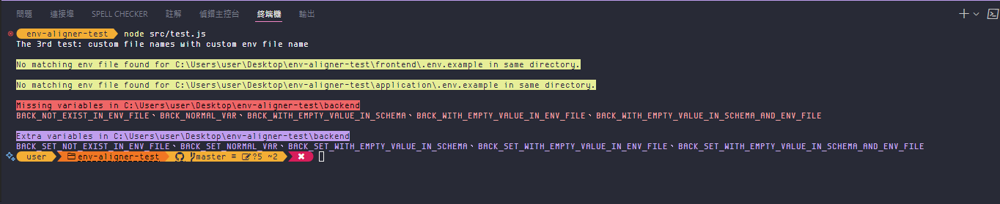

# 請檢查以下測試是否通過
已知問題：
1. 遞迴通常會按字母順序，但有時好像會錯亂。這算 bug 嗎？
2. #14 發現，指定路徑下沒有 `.env` 跟 `.env.example` 時連錯都不會噴

## Jeremy
### 程式檢查
- [x] 1. 預設檢查：application 第一層通過，在檢查 backend 有抓到錯誤，有停住
- [x] 2. 傳 `.env.sample` 跟 `.env.local`
- [x] 3. 只傳 `envName`: `.env.setting`：前面檢查有沒 match 同層的 `.env.setting`，不知道該不該打 `process.exit(1)`

- [x] 4. 只傳 `schemaName`: `.env.schema`
- [x] 5. 只傳 `isCheckMissing`: `false`
- [x] 6. 只傳 `isCheckEmpty`: `false`
- [x] 7. 只傳 `isCheckExtra`: `false`
- [x] 8. 全傳 `false`
- [x] 9. 全傳 `true`
- [x] 10. 傳兩個 `false`
- [x] 11. `rootDir` 傳 `'application/project'`
- [x] 12. `rootDir` 傳不存在的資料夾
- [x] 13. `rootDir` 傳存在的資料夾
- [x] 14. `rootDir` 傳很深的資料夾：已補 `.env` 跟 `.env.example`
- [x] 15. `rootDir` 傳同名但不同路徑的資料夾：沒啥意義的檢查
- [x] 16. schema 跟 env 檔案不在同一層
- [x] 17. schema 不存在：沒過，沒噴錯
- [x] 18. env 不存在：錯誤顯示同 #16
- [x] 19. schema 跟 env 都不存在：沒過，沒噴錯

### CLI 檢查
- [x] 1. `npx env-aligner`
- [x] 2. `npx env-aligner -h`
- [x] 3. `npx env-aligner -v`
- [x] 4. `npx env-aligner -s .env.sample`
- [x] 5. `npx env-aligner -e .env.local`
- [x] 6. `npx env-aligner -s .env.sample -e .env.local`
- [x] 7. `npx env-aligner --schema .env.sample --env .env.local`
- [x] 8. `npx env-aligner -m false`
- [x] 9. `npx env-aligner -m true`
- [x] 10. `npx env-aligner -n false`
- [x] 11. `npx env-aligner -x false`
- [x] 12. `npx env-aligner -m false -n false -x false`
- [x] 13. `npx env-aligner -m true -n true -x true`
- [x] 14. `npx env-aligner --missing false --empty false --extra false`
- [x] 15. `npx env-aligner -e .env.setting -s .env.schema` - 顛倒看抓不抓得到
- [x] 16. `npx env-aligner -e .env.setting -s .env.schema -m false -n false -x false`

## JuiCheng
### 程式檢查
- [x] 1. 預設檢查
- [x] 2. 傳 `.env.sample` 跟 `.env.local`
- [x] 3. 只傳 `envName`: `.env.setting`
- [x] 4. 只傳 `schemaName`: `.env.schema`
- [x] 5. 只傳 `isCheckMissing`: `false`
- [x] 6. 只傳 `isCheckEmpty`: `false`
- [x] 7. 只傳 `isCheckExtra`: `false`
- [x] 8. 全傳 `false`
- [x] 9. 全傳 `true`
- [x] 10. 傳兩個 `false`
- [x] 11. `rootDir` 傳 `'application/project'`
- [x] 12. `rootDir` 傳不存在的資料夾
- [x] 13. `rootDir` 傳存在的資料夾
- [x] 14. `rootDir` 傳很深的資料夾
- [x] 15. `rootDir` 傳同名但不同路徑的資料夾
- [x] 16. schema 跟 env 檔案不在同一層
- [x] 17. schema 不存在
- [x] 18. env 不存在
- [x] 19. schema 跟 env 都不存在

### CLI 檢查
- [x] 1. `npx env-aligner`
- [x] 2. `npx env-aligner -h`
- [x] 3. `npx env-aligner -v`
- [x] 4. `npx env-aligner -s .env.sample`
- [x] 5. `npx env-aligner -e .env.local`
- [x] 6. `npx env-aligner -s .env.sample -e .env.local`
- [x] 7. `npx env-aligner --schema .env.sample --env .env.local`
- [x] 8. `npx env-aligner -m false`
- [x] 9. `npx env-aligner -m true`
- [x] 10. `npx env-aligner -n false`
- [x] 11. `npx env-aligner -x false`
- [x] 12. `npx env-aligner -m false -n false -x false`
- [x] 13. `npx env-aligner -m true -n true -x true`
- [x] 14. `npx env-aligner --missing false --empty false --extra false`
- [x] 15. `npx env-aligner -e .env.setting -s .env.schema` - 顛倒看抓不抓得到
- [x] 16. `npx env-aligner -e .env.setting -s .env.schema -m false -n false -x false`